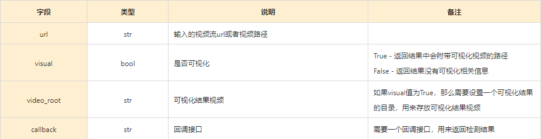
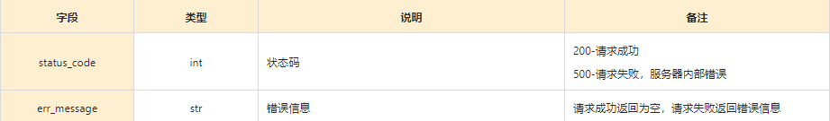
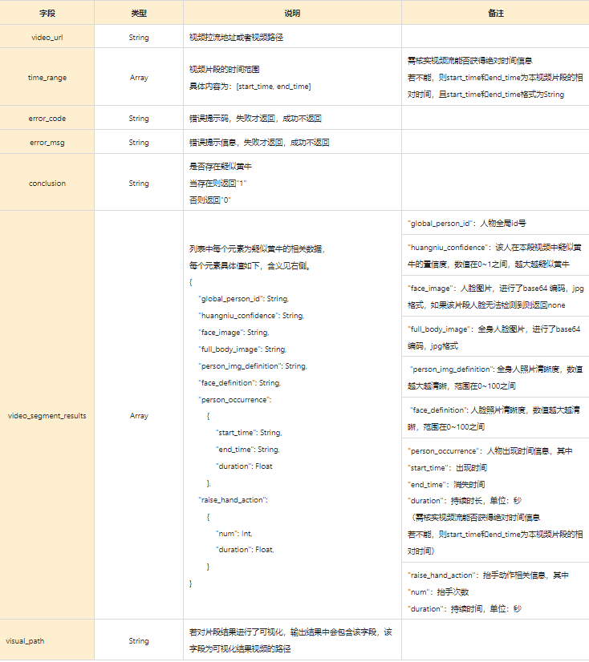

# 黄牛检测

## 一、算法介绍

本算法主要目的是检测出视频流中的疑似黄牛，目前针对的场景是杭州汽车城周边黄牛

目前主要针对的疑似黄牛类型为 ：

1）长时间出现在视频流中的人物；

2）多次抬手的人物

这里具体多长时间和多少次抬手在代码中量化为一定阈值，可在src/configs/configs.py中进行设定，

相关变量名为：appear_rate_threshold、scalper_num_threshold

即只有当每段视频中的行人出现率超过appear_rate_threshold，或者检测到抬手的图像数超过scalper_num_threshold时，才会作为疑似黄牛返回对应人物的信息。

## 二、算法依赖

具体见 requirements.txt，

以及每个submodule下的 requirements.txt

## 三、重要参数配置

可通过修改src/configs/configs.py进行参数配置，

以下介绍的参数为在使用过程中较大概率需要修改的参数，其他未涉及到的参数可按照默认值使用。

**权重路径其他参数路径相关**

可通过修改single_frame_inference中的“model_weight_paths”字段值来修改该仓库相关的各个模型权重路径

可通过修改single_frame_inference中的“config_paths”字段值来修改该仓库相关的各个子模块参数配置项路径

**gpu设定相关**

可通过修改demo_configs中的"gpu_id"字段，来设定使用哪块GPU

**segment视频流设置相关**

可通过修改demo_configs中的"segment_time"字段，来设定单个segment片段有多少seconds

可通过修改demo_configs中的"segment_fps"字段，来设定单个segment片段的fps

##所以单个segment片段的总帧数为”segment_time“*”segment_fps“

**行人特征库相关**

可通过修改demo_configs中的"max_track_id_num"字段，来设定行人库最大id数

可通过修改demo_configs中的"max_feature_num_every_track_id"字段，来设定行人库单个id最多保存的特征数

**疑似黄牛阈值相关**

对于demo_configs中的"appear_rate_threshold"字段值，当单个segment中某个id的行人出现率>该值时，被认为是疑似黄牛输出

对于demo_configs中的"scalper_num_threshold"字段值，当单个segment中某个id的行人判为招手的次数>该值时，被认为是疑似黄牛输出

## 四、使用方法

1）首先使用git clone --recurse-submodules https://github.com/ahaqu01/scalper_detection.git下载本黄牛检测算法

2）然后按照二中的说明，进行相关环境的搭建

3）接着基于三中的说明，修改single_frame_inference中的“model_weight_paths”字段参数和ingle_frame_inference中的“config_paths”字段参数，使得各个权重和参数路径正确

4）接着就可以以下面两种方式使用该仓库代码了

### 4.1. 作为API使用

使用样例、输入参数和输出结果说明如下：

**使用样例：**

```python
import sys
sys.path.append("./src")
from scalper_demo import scalper_demo
sd = scalper_demo()
output_results = sd.demo(url, visual, video_root)
```

**输入参数：**

输入参数包含三个分别如下：

url：输入的视频流url或者视频路径

visual：是否可视化，如果该值设为True，那么返回结果中会附带可视化视频的路径，如果设为False，则返回结果没有可视化相关信息

video_root：如果visual值为True，那么需要设置一个可视化结果的目录，即video_root，用来存放可视化结果视频

**输出结果：**

输出为dict

相关字段介绍如下：


### 4.2. 作为服务使用

可直接运行主目录下的app.py，服务调用样例见app_user.py。服务接口返回值分为两次返回，接收到请求后立刻返回一次状态信息，同时后台开始调用检测算法，检测完毕后调用回调接口再次返回算法检测结果

接口请求参数如下



接口返回值如下



通过回调接口返回的算法检测结果返回值如下



